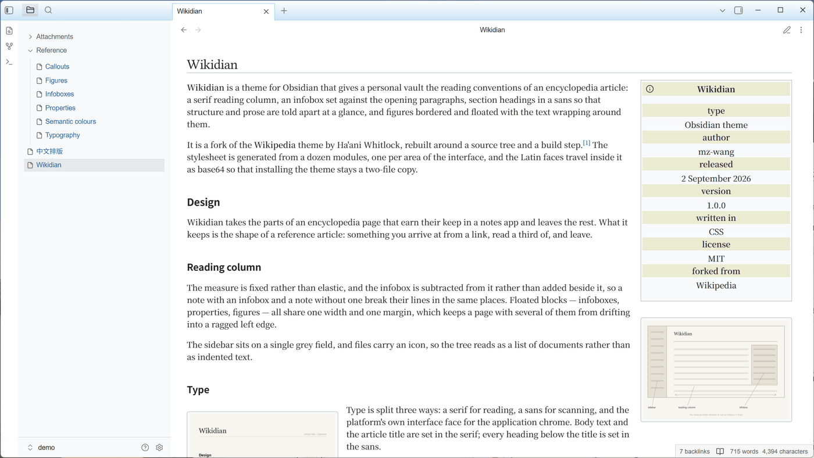
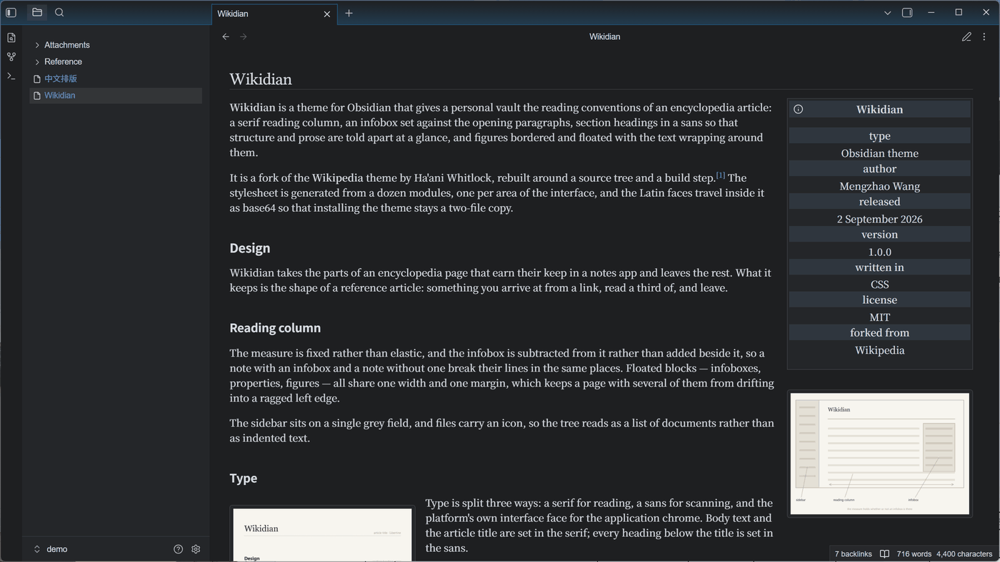
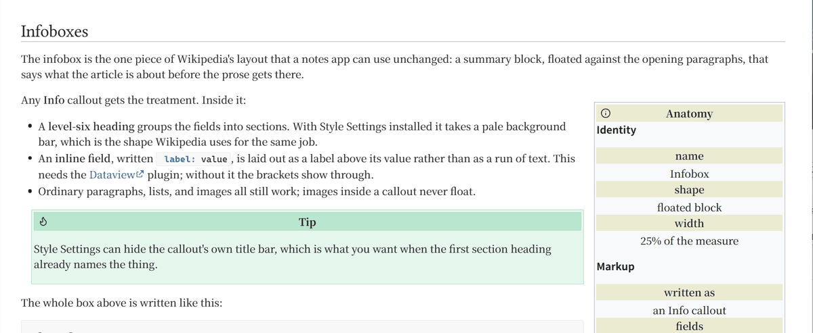
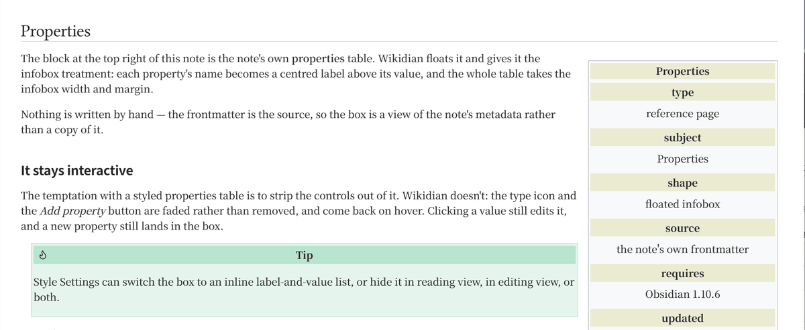
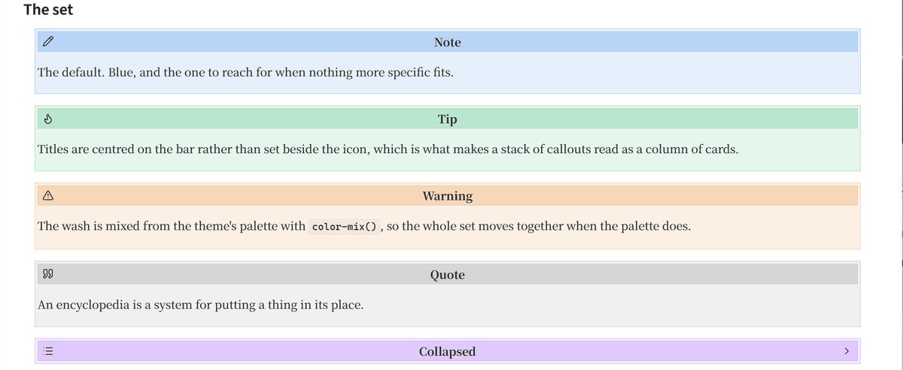
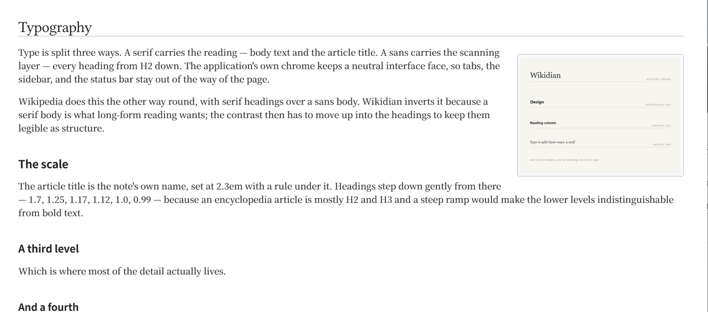
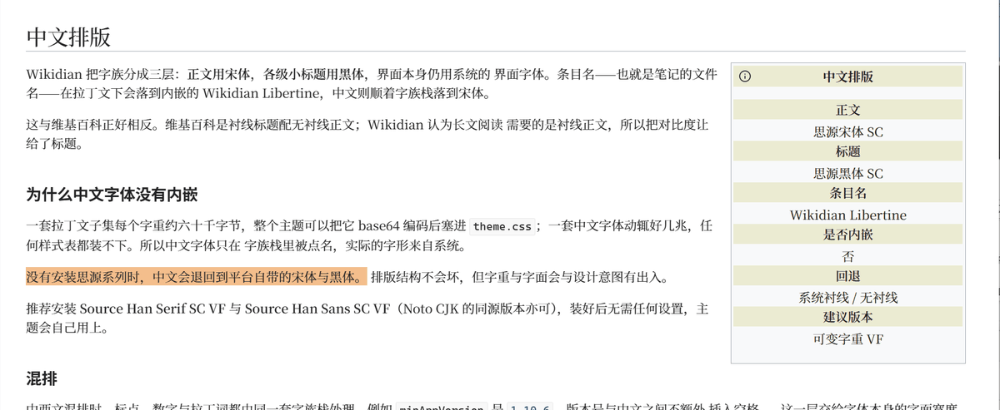
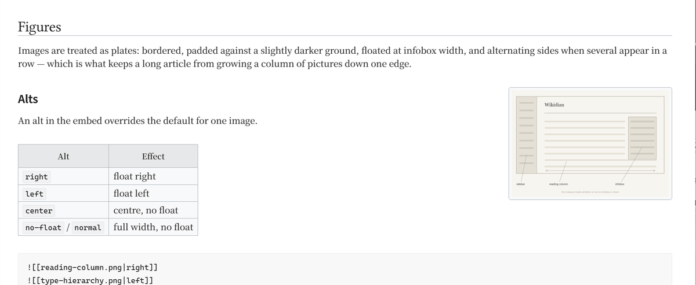
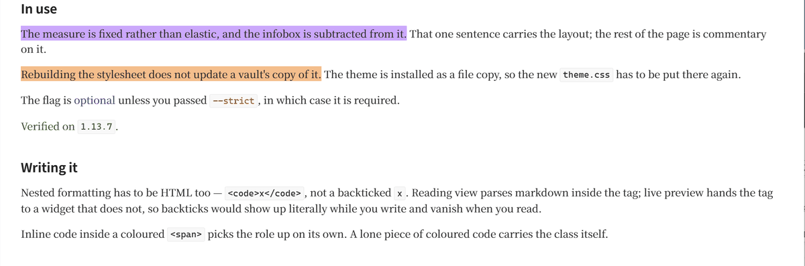

# Wikidian

An Obsidian theme that makes your vault read like an encyclopedia article.
Wikipedia-style headings, floating infoboxes, bordered images, and a sidebar
that gets out of the way.

> Wikidian is a fork of [Wikipedia][upstream] by Ha'ani Whitlock, rebuilt around
> a source tree and a build step. See [Credits](#credits).

> [!IMPORTANT]
> **Reading or writing CJK? Install the Source Han variable fonts.**
> The Latin faces ship inside `theme.css`, but a Chinese font runs to several
> megabytes and cannot travel with a stylesheet. For the intended look —
> body text and article titles in the serif, section headings in the sans —
> install [**Source Han Serif SC VF**][source-han-serif] and
> [**Source Han Sans SC VF**][source-han-sans] (the Noto CJK releases are the
> same fonts under a different name). Without them, CJK text falls back to
> whatever serif and sans your platform happens to provide.



<details>
<summary>The same note in dark mode</summary>



</details>

Every screenshot below is taken from `demo/`, a small vault that ships with the
repo — see [Demo vault](#demo-vault).

## Install

**From the community themes browser** — not yet listed.

**Manually** — copy `manifest.json` and `theme.css` into
`<vault>/.obsidian/themes/Wikidian/`, then pick **Wikidian** under
*Settings → Appearance → Themes*.

The [Style Settings][style-settings] plugin is optional but unlocks the ribbon,
frontmatter, infobox, and image-float options described below.

## Features

### Infoboxes

Any **Info** callout (`>[!info]`) floats to the right of the note like a
Wikipedia infobox. Inline Dataview fields written in brackets inside it — for
example `[category::research]` — are laid out on separate lines and styled like
infobox labels and values. A **Heading 6** inside the callout groups the fields
into sections; with Style Settings installed it takes a pale background bar as
well.



> [!tip]
> Hide the callout's own title with Style Settings for a cleaner infobox.

### Properties

A note's properties table is styled as an infobox too — floated, with each
property's name as a centred label above its value. It stays fully
interactive: the type icon and *Add property* button fade in on hover rather
than being removed. Style Settings can switch it to an inline label-and-value
list, or hide it in both views.



Requires Obsidian 1.10.6 or later — see `minAppVersion` in `manifest.json`.

### Callout alts

| Alt      | Effect                                                        |
| -------- | ------------------------------------------------------------- |
| `right`  | float the callout right                                       |
| `left`   | float the callout left                                        |
| `normal` | on an Info callout, drop the infobox styling                  |
| `info`   | give any callout the infobox look                             |

```markdown
>[!info|normal] Looks like a regular callout instead of an infobox.

>[!bug|right] A bug callout that floats right like an infobox.

>[!quote|left] Floats to the left.

>[!check|info] A Check callout wearing infobox styling.
```



### Typography

Body text and the article title (H1) are set in a serif; H2–H6 are set in a
sans, so the section headings read as structure rather than as more prose.

The Latin faces travel with the theme, so the title always renders in
**Wikidian Libertine**. CJK faces cannot — a Chinese font runs to several
megabytes — so they are named in the stack and come from the system: install
**Source Han Serif SC** and **Source Han Sans SC** (or their Noto twins) for
the intended look, otherwise Chinese text falls back to whatever serif and
sans the platform provides.





A font chosen under *Settings → Appearance* overrides all of this, as usual.

### Image alts

| Alt                    | Effect                  |
| ---------------------- | ----------------------- |
| `right`                | float right             |
| `left`                 | float left              |
| `center`               | center, no float        |
| `no-float` / `normal`  | full width, no float    |

```markdown
![[books.png|no-float]]

![[books.png|left]]

```



Images float by default and alternate sides when several appear in a row.
Images inside callouts never float. The global default is configurable in
Style Settings.

### Snippets

`snippets/` holds optional CSS snippets that are **not** part of the theme.
Copy one into `<vault>/.obsidian/snippets/` and enable it under
*Settings → Appearance → CSS snippets*.

- `float-images-callouts-blockquotes.css` — extends floating to blockquotes.
- `semantic-colors.css` — four semantic roles as a highlight or a text colour.

#### Semantic colours

`==highlight==` has one colour and no way to vary it, and there is no markdown
for a text colour at all, so `semantic-colors.css` defines four roles you write
as a tag. The tag picks the treatment and the class picks the role:

| Tag                           | Effect                    |
| ----------------------------- | ------------------------- |
| `<mark class="key">…</mark>`  | a wash behind the text    |
| `<span class="key">…</span>`  | the text itself           |
| `<code class="key">…</code>`  | inline code, chip and all |

| Role   | Colour | Meaning                                                 |
| ------ | ------ | ------------------------------------------------------- |
| `note` | blue   | an aside, a cross-reference, something to come back to   |
| `ok`   | green  | settled, verified, done                                  |
| `warn` | orange | a caveat, an open question, something that bites         |
| `key`  | purple | the load-bearing sentence on the page                    |



```markdown
<mark class="warn">Rebuilding does not update the vault's copy.</mark>

The flag is <span class="note">optional</span> unless you passed
<code class="warn">--strict</code>.

<span class="ok">Verified on <code>1.10.6</code> and later.</span>
```

Nested formatting has to be written as HTML too — `<code>x</code>`, not
`` `x` ``. Reading view parses markdown inside the tag, but live preview hands
the tag to a widget that does not, so backticks would show up literally while
you write and vanish when you read. Inline code inside a `<span>` picks the
role up on its own; a lone piece of coloured code carries the class itself.

The colours are the theme's own palette, so they follow it — darkened on the
light theme and lightened on the dark one, where the palette's mid tones would
otherwise sit around 3:1 against the page. Each role is a couple of lines in
the snippet: change a hue, rename a role, add a fifth.

## Development

`theme.css` is generated. Edit the modules in `src/` and rebuild:

```sh
uv run build.py            # regenerate theme.css
uv run build.py --check    # fail if theme.css is stale (what CI runs)
npm install && npm run lint    # stylelint, using Obsidian's own config
npm run lint:fix               # apply the fixable ones
```

`src/*.css` is concatenated in filename order, and `{{ font: ... }}`
placeholders are replaced with base64 data URIs from `fonts/`. The fonts are
inlined because Obsidian installs a theme by copying only `manifest.json` and
`theme.css` — there is no second file it would fetch.

```
src/                        theme source, one file per area
fonts/                      subset WOFF2 faces + their license
build.py                    src/ + fonts/ -> theme.css
snippets/                   optional add-ons, not part of the theme
demo/                       the vault every screenshot is taken from
screenshots/                store and README images
tools/subset_fonts.py       regenerate the font subsets from upstream
tools/make_demo_figures.py  the plates inside demo/Attachments
tools/setup_demo_vault.py   install the built theme into demo/
tools/make_screenshots.py   drive Obsidian and write screenshots/
tools/capture_window.ps1    grab the Obsidian window (Windows)
```

To iterate, copy or symlink the repo into
`<vault>/.obsidian/themes/Wikidian/` — the folder name must match `name` in
`manifest.json` — and reload Obsidian after each build.

### Demo vault

`demo/` is an Obsidian vault whose notes are an encyclopedia entry about the
theme itself, a reference page per feature, and one page in Chinese. Every
screenshot in this README comes from it, so the images can be rebuilt for a
release instead of being re-staged by hand.

The notes, their figures, and the vault's settings are tracked. Anything that
is a copy of something else is not — the theme, the snippet, the Dataview
plugin — so the vault needs one command before it looks right:

```sh
uv run build.py
uv run tools/setup_demo_vault.py
```

Then open `demo/` as a vault and install **Dataview** from *Settings →
Community plugins*: the infoboxes are built from its inline `field:: value`
syntax, and without it the brackets show through. `uv run
tools/make_demo_figures.py` redraws the plates in `demo/Attachments/`.

With the vault open, rebuild the images in `screenshots/`:

```sh
uv run --with pillow tools/make_screenshots.py
uv run --with pillow tools/make_screenshots.py --only callouts --only cjk
```

It drives the running app over the Obsidian CLI — open a note, switch theme,
scroll to a heading — grabs the window, and crops to element geometry read out
of the live DOM, so a crop stays right when the content moves. It switches the
app to English for the run and puts the language back afterwards. Windows only:
the capture step is PowerShell.

The run stops rather than writing a wrong image if the window does not take the
size it was asked for, if it cannot be brought to the foreground — Obsidian does
not render its reading view in the background, so the grab would be of a blank
pane — or if a `Shot`'s anchor heading is no longer in the note, in which case
it prints the headings that *are* there. Rename a heading in `demo/` and the
next run will tell you which anchor to fix.

Release and store-submission steps are in [RELEASING.md](RELEASING.md).

## Credits

Wikidian is derived from **[Wikipedia][upstream]** by Ha'ani Whitlock, used
under the MIT License. Much of the original CSS was adapted from wikipedia.org
and mapped onto Obsidian's components. Both copyright notices are retained in
[LICENSE](LICENSE), and the derivation is stated in [NOTICE](NOTICE).

Article titles are set in **Wikidian Libertine**, a Latin subset of *Linux
Libertine O* by Philipp H. Poll, used under the SIL Open Font License 1.1. See
[fonts/README.md](fonts/README.md) and [fonts/OFL.txt](fonts/OFL.txt).

This project is not affiliated with or endorsed by Wikipedia or the Wikimedia
Foundation.

## License

[MIT](LICENSE) for the theme. Bundled fonts are under the
[SIL OFL 1.1](fonts/OFL.txt).

[source-han-serif]: https://github.com/adobe-fonts/source-han-serif/releases
[source-han-sans]: https://github.com/adobe-fonts/source-han-sans/releases
[upstream]: https://github.com/Bluemoondragon07/Wikipedia-Theme
[style-settings]: https://github.com/mgmeyers/obsidian-style-settings
